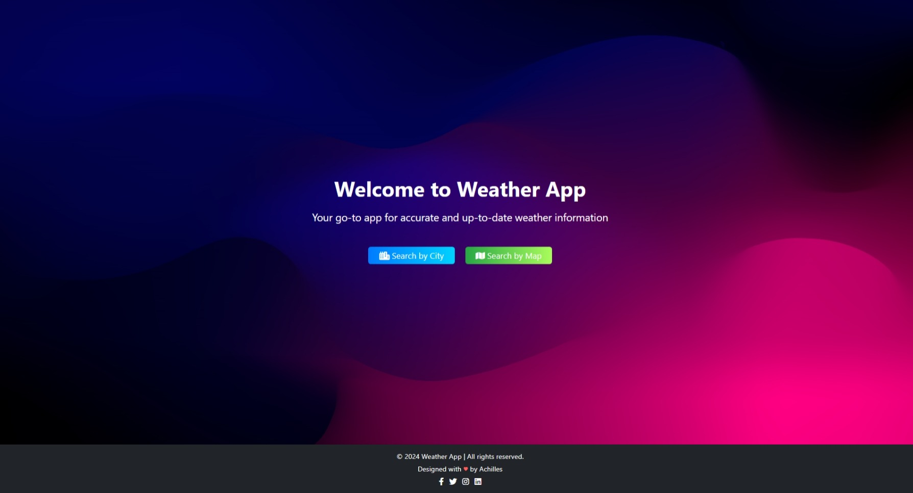
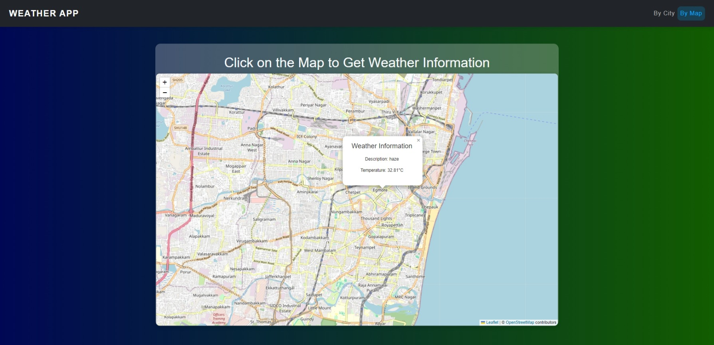
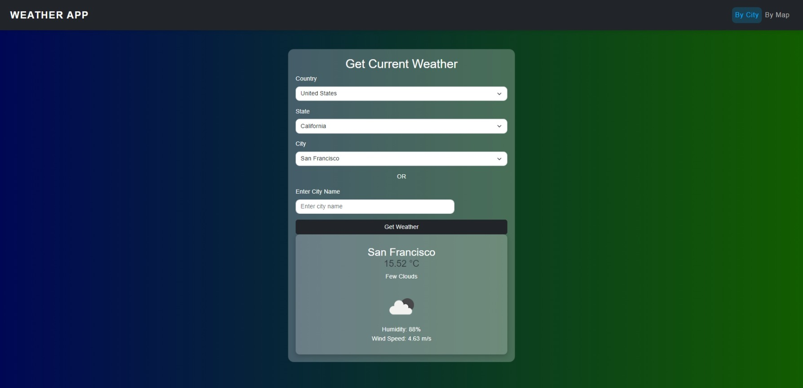

# Weather App

This is a Django-based weather application that allows users to get weather information through different methods, including clicking on a map, selecting a location from dropdowns (country, state, city), or typing the city name directly.

## Features

- **Weather by Map**: 
  - Click on any location on the map to fetch weather details.
  
- **Dropdown Selection**:
  - Select a country, state, and city from dropdown menus to retrieve the weather information.
  
- **City Name Input**:
  - Enter a city name manually to get the weather details.

## Getting Started

Follow these steps to set up and run the application:

1. **Create a Virtual Environment**

```bash
python -m venv myenv
```

2. **Activate the Virtual Environment**

```bash
myenv\Scripts\activate
```

3. **Install Required Packages**

```bash
pip install django leaflet requests
```

4. **Set Up OpenWeatherMap API**
    - Sign up at OpenWeatherMap to get your API key.
    - Add your API key to views.py

5. **Run the Application**

```bash
python manage.py migrate
python manage.py runserver
```

## Pages Overview

### 1. Home Page


### 2. Weather by Map


### 3. Weather by Dropdown Selection


### 4. Weather by City Name


## Usage

1. **Weather by Map:**
   - Click anywhere on the interactive map to retrieve the weather data for that location.

2. **Dropdown Selection:**
   - Use the dropdown menus to select a country, state, and city to get the weather details.

3. **City Name Input:**
   - Type in the city name to directly retrieve weather information.

## Contributing

Contributions are welcome! Feel free to submit a pull request with any improvements or new features.

---

**Note:** For any questions or issues, feel free to open an issue in the repository.
